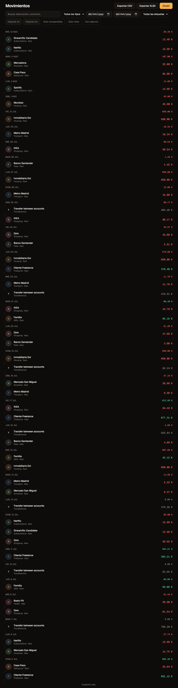

<div align="center">

# Nido

**Collaborative household finance, from one person to a full flatshare.**

Track every euro that enters and leaves your home — alone, as a couple, or with roommates.
Split expenses any way you want, set budgets that actually warn you, chase savings goals,
tame subscriptions, and eventually just _ask_ your data where the money is going.

[](./LICENSE)
[](https://nextjs.org)
[](https://supabase.com)
[](#)

[](https://vercel.com/new/clone?repository-url=https%3A%2F%2Fgithub.com%2FEdvinCodes%2Fnido&env=NEXT_PUBLIC_SUPABASE_URL,NEXT_PUBLIC_SUPABASE_ANON_KEY,NEXT_PUBLIC_APP_URL,SUPABASE_SERVICE_ROLE_KEY&project-name=nido&repository-name=nido)

</div>

---

> **Status: phases 00–11 shipped; phase 12 (AI assistant) in progress.** The assistant
> works when a provider is configured; the 30/30 numeric eval gate is not a v1 blocker.
> Track progress in [`docs/phases/README.md`](./docs/phases/README.md).



## Why Nido

Most personal finance apps assume one wallet and one person. Real homes don't work like that:
rent is split 50/50, the supermarket run is split three ways minus the person who was away,
one of you paid for the flight and the other owes half, and somebody is still paying for a
streaming service nobody watches.

Nido is built around **spaces** (a household) rather than around a single user. Every amount
knows who paid it, who owes it, and what it was for. Once the data is honest, everything
else — analytics, budgets, debt settlement, and an AI assistant that can actually answer
"where can we cut 200 € a month?" — falls out of it.

## Core capabilities

| Area               | What it does                                                                                                  |
| ------------------ | ------------------------------------------------------------------------------------------------------------- |
| **Spaces**         | Solo, couple, or shared (N members). Roles, invitations, per-space settings and base currency.                |
| **Ledger**         | Income and expenses with payer, date, account, category, notes, tags, and attachments.                        |
| **Splitting**      | Personal, equal, by shares, by percentage, or exact amounts. Cent-perfect, no rounding drift.                 |
| **Categories**     | Custom trees with colors and icons, plus a sensible default set on space creation.                            |
| **Budgets**        | Daily / weekly / monthly / yearly limits, global or per category, per member or per space, with rollover.     |
| **Alerts**         | Threshold notifications (50/80/100 %) in-app, via web push, and by email.                                     |
| **Goals**          | Savings pots with target dates, progress, and contributions from any member.                                  |
| **Subscriptions**  | Recurring charges and income with forecasting, renewal reminders, and "ghost subscription" detection.         |
| **Balances**       | Who owes whom, with a minimum-transfer settlement algorithm and settlement history.                           |
| **Receipts**       | Photo or PDF attachments with on-device compression and optional AI extraction of amount, merchant, and date. |
| **Import**         | CSV/XLSX bank statement import with column mapping, deduplication, and rule-based auto-categorization.        |
| **Bank sync**      | Optional PSD2 open banking connection through a pluggable provider interface.                                 |
| **Multi-currency** | Amounts stored in their original currency, converted to the space base currency at transaction date.          |
| **Reports**        | Monthly close, PDF and Excel exports, period comparison.                                                      |
| **AI assistant**   | Tool-calling agent over your own data. Bring your own key: OpenAI, Anthropic, Google, or fully local Ollama.  |

## Tech stack

- **Next.js 16** (App Router, React Server Components, Server Actions) + **TypeScript** (strict)
- **Tailwind CSS v4** + **shadcn/ui** + **Motion** for a dark-first, premium interface
- **Supabase**: Postgres with Row Level Security, Auth, Storage, Realtime, Edge Functions, `pg_cron`
- **TanStack Query / Table**, **react-hook-form** + **Zod**, **next-intl**, **Recharts**
- **AI SDK** with a swappable model provider
- **Vitest** + **Playwright** + **pgTAP**, GitHub Actions CI, deployed on **Vercel**

Full reasoning and rejected alternatives: [`docs/07-ADR.md`](./docs/07-ADR.md).

## Documentation

Browse the spec at [`/docs`](http://localhost:3000/docs) when running locally, or read the
Markdown files in [`docs/`](./docs/).

| Document                                                 | Purpose                                                                 |
| -------------------------------------------------------- | ----------------------------------------------------------------------- |
| [`docs/00-PROJECT.md`](./docs/00-PROJECT.md)             | Vision, scope, principles, personas, glossary, roadmap                  |
| [`docs/01-ARCHITECTURE.md`](./docs/01-ARCHITECTURE.md)   | System design, folder structure, data flow, security, deployment        |
| [`docs/02-DATA-MODEL.md`](./docs/02-DATA-MODEL.md)       | Complete SQL schema, RLS policies, functions, money and splitting rules |
| [`docs/03-DESIGN-SYSTEM.md`](./docs/03-DESIGN-SYSTEM.md) | Brand, tokens, typography, components, motion, landing page             |
| [`docs/04-FEATURES.md`](./docs/04-FEATURES.md)           | Functional specification, screen by screen                              |
| [`docs/05-AI-ASSISTANT.md`](./docs/05-AI-ASSISTANT.md)   | Assistant architecture, tools, guardrails, privacy                      |
| [`docs/06-CONVENTIONS.md`](./docs/06-CONVENTIONS.md)     | Code style, git, testing, CI, definition of done                        |
| [`docs/07-ADR.md`](./docs/07-ADR.md)                     | Architecture decision records                                           |
| [`docs/phases/`](./docs/phases)                          | Executable build plan, one file per phase                               |

## Getting started

Requires [Docker](https://docs.docker.com/get-docker/) for the local Supabase stack and Node 22+.

```bash
git clone https://github.com/EdvinCodes/nido.git
cd nido
pnpm install
cp .env.example .env.local
pnpm db:start      # local Postgres + Auth + Storage
pnpm db:reset      # apply migrations and seed demo data
pnpm dev
```

Open <http://localhost:3000>. The seed creates a demo space with two members and three
months of realistic transactions so every screen has something to show.

Regenerate marketing screenshots after UI changes:

```bash
pnpm dev   # in one terminal
pnpm screenshots
```

## Self-hosting

**Docker Compose** (Next.js app + Supabase CLI on the host):

```bash
pnpm db:start && pnpm db:reset
docker compose up --build
```

Copy keys from `supabase status` into `.env.local` before building. See
[`docs/01-ARCHITECTURE.md`](./docs/01-ARCHITECTURE.md) §10.

**Vercel + Supabase Cloud** is the primary deployment path — use the Deploy button above and
set `NEXT_PUBLIC_SUPABASE_URL`, `NEXT_PUBLIC_SUPABASE_ANON_KEY`, `NEXT_PUBLIC_APP_URL`, and
`SUPABASE_SERVICE_ROLE_KEY`.

## Privacy

Your financial data stays in your own database. Row Level Security means a member of one
space can never read another space's rows, even with a leaked anon key. The AI assistant is
opt-in, requires your own API key, and can run entirely offline against a local model.
No analytics, no trackers, no third-party pixels.

## Contributing

Issues and pull requests are welcome. Read [`CONTRIBUTING.md`](./CONTRIBUTING.md) and
[`docs/06-CONVENTIONS.md`](./docs/06-CONVENTIONS.md) first.

## License

MIT © EdvinCodes
